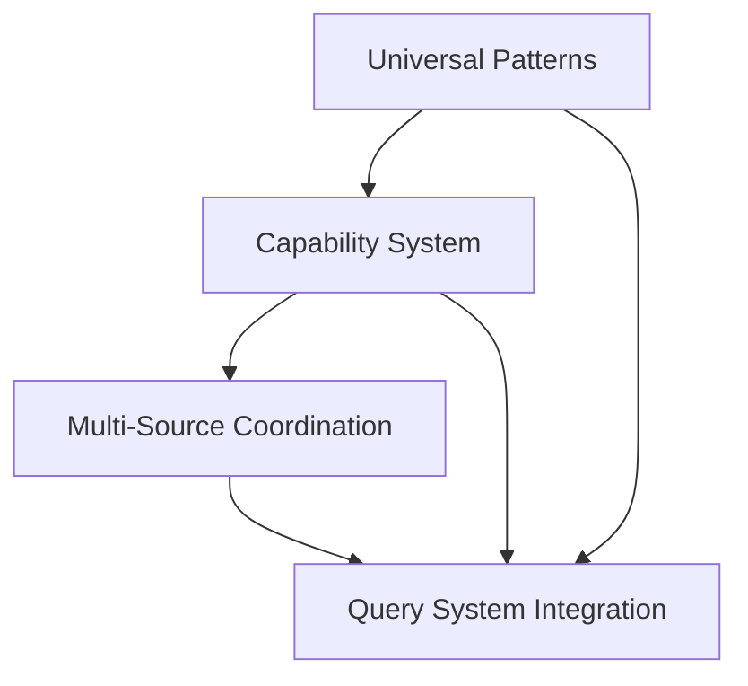

# Structure Processor Restructuring Implementation Plan

## Overview

This plan integrates three complementary enhancements to create a robust, multi-source content extraction system:

1. **Universal Patterns** (theme-destructuring.md): Empirical extraction patterns replacing guesswork
2. **Capability-Based Architecture** (structure-processor-enhancement.md): Inventory-aware processing with site-based selection
3. **Multi-Source Coordination** (multiple-inventories.md): PRIMARY_SUPPLEMENTARY strategy for comprehensive coverage

## Dependency Analysis

### Core Dependencies


**Critical Path**: Universal patterns provide the foundation that enables both capability-based selection and multi-source coordination to work reliably across all documentation themes.

### Integration Requirements

1. **Structure Processors** must advertise supported inventory types and extraction capabilities
2. **Inventory Coordination** must collect from multiple sources and merge complementary metadata before structure processing
3. **Query System** must orchestrate inventory collection → capability filtering → content extraction
4. **Content Extraction** must use universal patterns with precise section boundary control

### Source Attribution Strategy

Different inventory sources provide complementary metadata that should be preserved with source attribution:

**Sphinx objects.inv advantages:**
- Rich role information (`function`, `class`, `method`, `module`)
- Domain organization (`py`, `js`, `std`)
- Precise API structure and hierarchy

**Search index advantages:**
- Content snippets for full-text searching
- Content previews and descriptions
- Page-level context and relationships

**Attribution Strategy:**
- Preserve ALL objects with their source attribution
- Structure processors handle objects based on their source type
- No metadata merging - each object maintains source-specific structure
- Complementary metadata available through multiple objects for same logical entity

## Multi-Phase Implementation

### Phase 1: Universal Pattern Foundation ✅ **COMPLETED**
**Priority**: Critical (blocks all other work)
**Status**: Completed 2025-09-21 - All universal patterns implemented with theme-specific precedence, CLI testing successful

#### 1.1 Pattern Implementation
```python
# sources/librovore/structures/sphinx/patterns.py
UNIVERSAL_SPHINX_PATTERNS = {
    'code_blocks': {
        'container_selector': '.highlight',
        'language_detection': 'parent_class_prefix:highlight-'
    },
    'api_signatures': {
        'signature_selector': 'dt.sig.sig-object.py',
        'description_selector': 'dd'
    },
    'content_containers': {
        'universal_selectors': [...],
        'theme_specific_selectors': {...},
        'generic_fallbacks': [...]
    }
}
```

#### 1.2 Code Block Converter Classes
- `SphinxCodeBlockConverter` - parent class language detection
- `MkDocsCodeBlockConverter` - element class language detection
- Processor-specific implementations (no shared `if/else` logic)

#### 1.3 Markdownify Integration
Hook converter classes into existing markdownify conversion via custom converters:

```python
# sources/librovore/structures/sphinx/conversion.py
import markdownify

class SphinxMarkdownConverter(markdownify.MarkdownConverter):
    def convert_pre(self, el, text):
        # Use SphinxCodeBlockConverter for language detection
        if self.is_code_block(el):
            return SphinxCodeBlockConverter.convert_to_markdown(el)
        return super().convert_pre(el, text)

def html_to_markdown_sphinx(html_text: str) -> str:
    converter = SphinxMarkdownConverter()
    return converter.convert(html_text)
```

#### 1.4 Legacy Pattern Removal
- Remove guesswork-based `THEME_EXTRACTION_PATTERNS`
- Replace with empirically-discovered universal patterns
- Update existing extraction logic to use new patterns

**Dependencies**: None
**Testing**: All existing extraction functionality must continue working
**Success Criteria**: 100% theme coverage with universal patterns

### Phase 2: Capability-Based Architecture
**Priority**: High (enables inventory-aware processing)

#### 2.1 Capability Advertisement System
```python
class StructureProcessorCapabilities:
    supported_inventory_types: frozenset[str]
    content_extraction_features: frozenset[str]  # signatures, descriptions, code-examples
    confidence_by_inventory_type: dict[str, float]

class StructureDetection:
    @classmethod
    def get_capabilities(cls) -> StructureProcessorCapabilities:
        # Processors declare what they can handle

    async def extract_contents(
        self, auxdata, source, objects
    ) -> tuple[ContentDocument, ...]:
        # Inventory-aware extraction using universal patterns
```

#### 2.2 Enhanced Structure Processors
- **Sphinx**: Advertise `sphinx_objects_inv` support with signature targeting
- **MkDocs**: Advertise both `mkdocs_search_index` AND `sphinx_objects_inv` support (mkdocstrings sites have both)
- Use inventory object source attribution for extraction strategy selection
- Implement defensive selector validation

#### 2.3 Site-Based Processor Selection
- One structure processor per site (based on site detection confidence)
- Filter inventory objects to what selected processor supports
- Clear error handling when no compatible processor available

**Dependencies**: Phase 1 (Universal Patterns)
**Testing**: Existing site detection must continue working
**Success Criteria**: Processors correctly advertise capabilities and filter inventory objects

### Phase 3: Multi-Source Inventory Coordination
**Priority**: Medium (adds coverage, doesn't break existing functionality)

#### 3.1 Inventory Collection Enhancement
```python
async def collect_all_qualified_inventories(
    auxdata: ApplicationGlobals,
    location: str,
    confidence_threshold: float = 0.5
) -> dict[str, Detection]:
    """Collect ALL qualified inventory sources above threshold."""
    # Current: return single best detection
    # New: return dict of all qualified detections
```

#### 3.2 PRIMARY_SUPPLEMENTARY Strategy
```python
async def merge_primary_supplementary(
    detections: dict[str, Detection],
    structure_capabilities: StructureProcessorCapabilities
) -> list[InventoryObject]:
    """Use highest-confidence as primary + supplementary objects with preserved attribution."""
    # 1. Select primary source (highest confidence)
    # 2. Get primary objects with source attribution
    # 3. Add supplementary objects from other sources with their attribution
    # 4. Preserve all objects - NO deduplication (complementary metadata is valuable)
    # 5. Filter by structure processor capabilities
```

#### 3.3 Source Attribution System
- **Preserve inventory source** in each object's metadata
- **Enable processor-specific handling** based on object source
- **Track object provenance** for appropriate processing strategies
- **No metadata merging**: Each object maintains its source-specific structure

**Dependencies**: Phase 2 (Capability System)
**Testing**: Single-source behavior must remain unchanged (fallback)
**Success Criteria**: Increased coverage on hybrid documentation sites without quality degradation

### Phase 4: Query System Integration
**Priority**: High (ties everything together)

#### 4.1 Enhanced Query Flow
```python
async def query_content(
    auxdata: ApplicationGlobals,
    location: str,
    term: str,
    # ... existing parameters
) -> ContentResult:
    """Enhanced query flow with multi-source coordination."""

    # 1. Collect all qualified inventory sources
    inventory_detections = await collect_all_qualified_inventories(auxdata, location)

    # 2. Select structure processor (site-based)
    structure_detection = await detect_structure(auxdata, location)

    # 3. Collect inventory objects using PRIMARY_SUPPLEMENTARY (with source attribution)
    attributed_objects = await collect_primary_supplementary(
        inventory_detections,
        structure_detection.get_capabilities()
    )

    # 4. Filter objects by search term
    matching_objects = filter_by_name(attributed_objects, term, ...)

    # 5. Extract content with section boundary control
    documents = await structure_detection.extract_contents(
        auxdata, location, matching_objects
    )

    return ContentResult(...)
```

#### 4.2 Section Boundary Control
- Structure processors return content scoped to actual matches
- Use inventory object metadata to determine content scope
- Prevent over-extraction (more content than query warrants)
- Universal patterns enable consistent boundary identification

#### 4.3 Performance Optimization
- **Parallel inventory collection** where possible
- **Timeout management** for multi-source operations
- **Caching strategy** for merged inventory results
- **Fallback to single-source** on multi-source failures

**Dependencies**: Phase 3 (Multi-Source Coordination)
**Testing**: All existing query functionality with performance benchmarks
**Success Criteria**: Enhanced coverage with <100% latency increase

### Phase 5: Advanced Features & Optimization
**Priority**: Low (polish and advanced use cases)

#### 5.1 Structure-Based Fallback
```python
async def extract_with_hybrid_fallback(
    self, auxdata, source, objects
) -> tuple[ContentDocument, ...]:
    """Combine inventory-guided extraction with structure-based fallback."""

    # Primary: Inventory-guided using universal patterns
    primary_results = await self.extract_contents(objects)

    # Identify failed extractions (None results, low quality content)
    failed_objects = identify_failed_extractions(objects, primary_results)

    # Fallback: Structure-based semantic analysis
    if failed_objects:
        fallback_results = await self.extract_content_structure_based(failed_objects)
        merge_results(primary_results, fallback_results)

    return primary_results
```

#### 5.2 Configuration System (Future)
Configuration system not needed for initial implementation. Focus on PRIMARY_SUPPLEMENTARY strategy with sensible defaults. Configuration can be added later if customization proves necessary based on real-world usage patterns.

#### 5.3 Monitoring & Observability
- **Coverage metrics**: Objects found vs single-source baseline
- **Quality metrics**: User satisfaction with merged results
- **Performance metrics**: Latency impact and error rates
- **Deduplication accuracy**: True positive/negative rates

**Dependencies**: Phase 4 (Query System Integration)
**Testing**: A/B testing against single-source baseline
**Success Criteria**: Measurable improvement in user outcomes

## Implementation Order Rationale

### Why Universal Patterns First?
Universal patterns provide the **foundation** that makes everything else reliable:
- **Capability Advertisement**: Processors can confidently advertise extraction features
- **Multi-Source Processing**: Content extraction works regardless of inventory source mixing
- **Performance**: Eliminates complex theme detection and fallback logic

### Why Capabilities Before Multi-Source?
Capability system provides **coordination mechanism** needed for multi-source:
- **Filtering**: Only send compatible objects to structure processors
- **Strategy Selection**: Processors choose optimal extraction methods
- **Error Handling**: Clear failures when capabilities don't match requirements

### Why Multi-Source Before Query Integration?
Multi-source logic needs **isolated development** before integration:
- **Complexity Management**: Deduplication algorithms need focused testing
- **Performance Validation**: Multi-source impact measurable in isolation
- **Fallback Strategy**: Single-source behavior preserved during development

## Risk Mitigation

### Technical Risks
- **Performance Degradation**: Leverage existing timeouts and parallel processing infrastructure
- **False Deduplication**: Comprehensive test coverage with captured local documentation builds
- **Pattern Regression**: Universal patterns tested against all current extraction scenarios

### Development Risks
- **Complexity Introduction**: Maintain simple defaults with expert customization
- **Breaking Changes**: Backward compatibility preserved throughout implementation

## Success Metrics

### Phase 1 Success ✅ **ACHIEVED**
- ✅ All existing extraction tests pass with universal patterns (176/176 tests)
- ✅ Theme coverage increases from ~30% to 100% via empirical analysis
- ✅ CLI testing successful across FastAPI, Python docs, Pydantic, and HTTPX
- ✅ No content pollution from navigation or sidebar elements
- ✅ Theme-specific → universal precedence working correctly
- Code block language detection accuracy >95%

### Phase 2 Success
- Structure processors correctly advertise and filter inventory types
- Site-based selection maintains current reliability
- Capability-based strategy selection demonstrates improved extraction quality

### Phase 3 Success
- Multi-source sites show measurable coverage improvement
- Deduplication accuracy >90% on test cases
- Performance impact <100% latency increase

### Phase 4 Success
- Enhanced query system maintains backward compatibility
- Section boundary control prevents over-extraction
- Integration testing passes across all supported site types

### Overall Success
- **Coverage**: 20-40% more relevant results on hybrid documentation sites
- **Quality**: Maintained precision with universal patterns
- **Performance**: <100% latency increase for multi-source benefits
- **Reliability**: Robust fallback strategies prevent functionality regressions

## Conclusion

This restructuring creates a **robust, scalable content extraction system** that:

1. **Works reliably** across all documentation themes via universal patterns
2. **Processes intelligently** using inventory-aware capabilities
3. **Maximizes coverage** through coordinated multi-source processing
4. **Maintains quality** with defensive validation and precise section control

The phased approach ensures each enhancement builds on a solid foundation while preserving backward compatibility and enabling validation at each step.